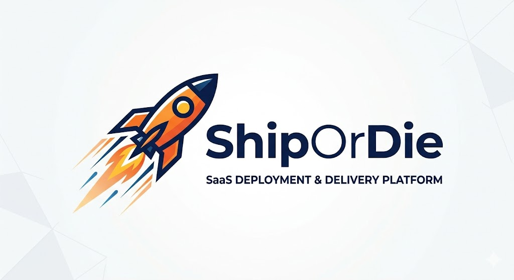
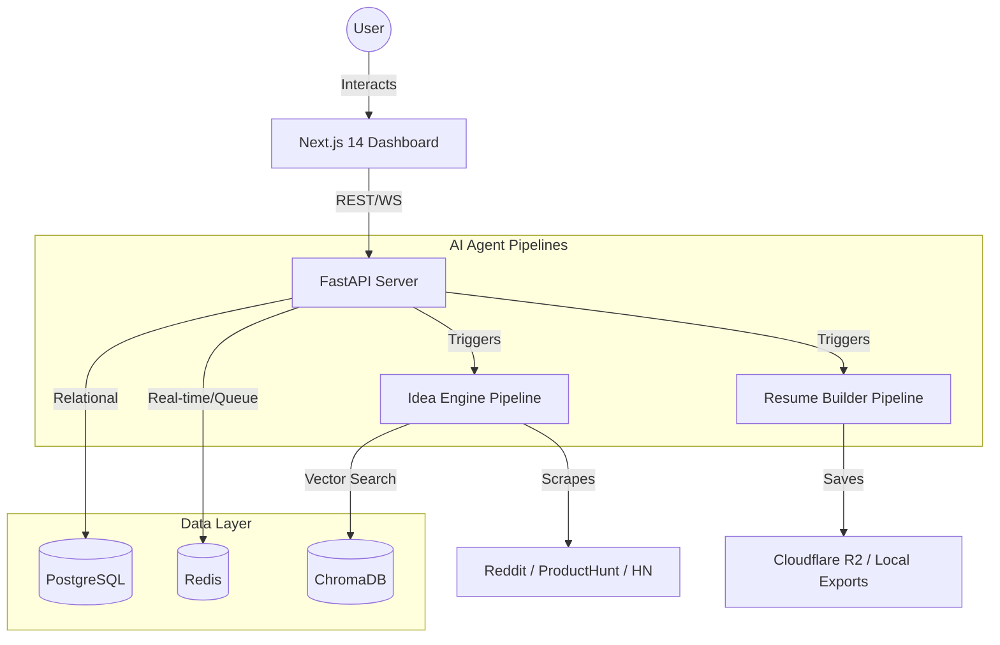
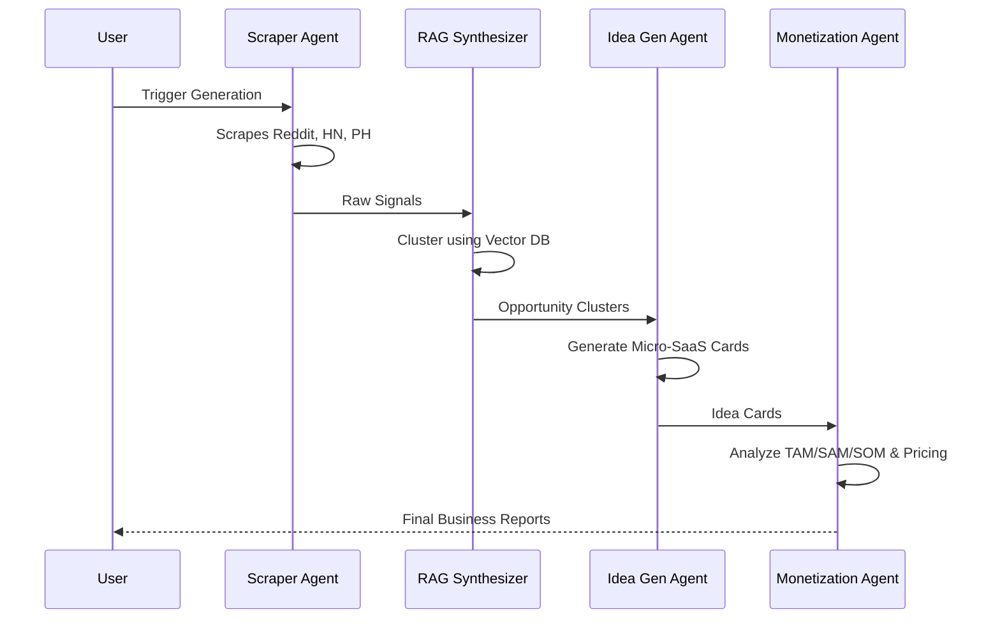
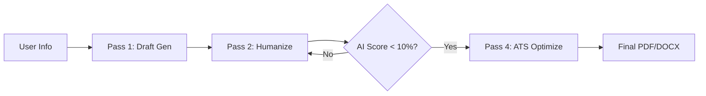

# 🚀 ShipOrDie: The Multi-Agent Powerhouse for Indie Hackers

<div align="center">
  
  <p align="center">
    <strong>From market noise to validated SaaS ideas and ATS-proof resumes in minutes.</strong>
  </p>
</div>

---

[](https://fastapi.tiangolo.com/)
[](https://nextjs.org/)
[](https://www.crewai.com/)
[](https://www.postgresql.org/)
[](https://www.docker.com/)

## 🌟 What is ShipOrDie?

ShipOrDie is a cutting-edge, multi-agent platform designed for the modern entrepreneur and job seeker. It leverages a pipeline of specialized AI agents to solve two major bottlenecks: **Idea Validation** and **Resume Optimization**.

### 💡 Module 1: Idea Engine
Stop guessing what to build. Our agents scrape real-time market signals from Reddit, ProductHunt, and HackerNews to synthesize profitable Micro-SaaS ideas with complete monetization strategies.

### 📄 Module 2: Resume Builder
Beat the AI detectors and the ATS. Generate resumes that sound authentically human, optimized for specific job descriptions, and designed to land you interviews.

---

## 🏗️ System Architecture



---

## ⚡ The Idea Engine Pipeline
*Watch your agents turn raw market signals into a business plan.*



> **[GIF PLACEHOLDER: Idea Generation Workflow Animation]**
> *Record your screen while clicking 'Generate Ideas' and show the live progress bars.*

---

## 🖋️ The Resume Builder Pipeline
*Crafting resumes that AI detectors can't catch.*



### Why our resumes are different:
- **Burstiness & Perplexity:** We inject natural human writing rhythms.
- **Forbidden Word Filter:** No more "leveraging" or "spearheading".
- **ATS Hardening:** Clean, standard layouts that parsers love.

---

## 🛠️ Tech Stack

| Category | Technology |
| --- | --- |
| **Frontend** | Next.js 14, Tailwind CSS, shadcn/ui, Zustand, NextAuth.js |
| **Backend** | FastAPI, CrewAI, LangGraph, Python 3.11+ |
| **AI/LLM** | Ollama (Local), Groq (Cloud Fallback), ChromaDB |
| **Infrastructure** | PostgreSQL, Redis, Docker, Cloudflare R2 |

---

## 🚀 Getting Started

### Prerequisites
- **Node.js 18+** & **npm/pnpm**
- **Python 3.11+**
- **Docker & Docker Compose**
- **Ollama** (for local LLM execution)

### 1. Setup Infrastructure
```bash
# Clone the repository
git clone https://github.com/yourusername/ShipOrDie.git
cd ShipOrDie

# Spin up Postgres, Redis, and ChromaDB
docker-compose up -d
```

### 2. Backend Setup
```bash
cd backend
python -m venv venv
source venv/bin/activate # Windows: venv\Scripts\activate
pip install -r requirements.txt
cp .env.example .env # Fill in your keys (Groq, Razorpay, etc.)
python main.py
```

### 3. Frontend Setup
```bash
cd frontend
npm install
cp .env.example .env.local
npm run dev
```

Visit `http://localhost:3000` to start shipping!

---

## 📂 Project Structure

```text
ShipOrDie/
├── backend/                # FastAPI Application
│   ├── agents/             # Specialized AI Agents (CrewAI)
│   ├── pipeline/           # LangGraph Workflow Logic
│   ├── routers/            # API Endpoints
│   ├── templates/          # Jinja2 Resume Templates
│   └── tools/              # Scrapers (Reddit, PH, HN)
├── frontend/               # Next.js 14 Application
│   ├── app/                # App Router (Pages & Layouts)
│   ├── components/         # shadcn/ui Components
│   └── store/              # Zustand State Management
└── docs/                   # Full Documentation (PRD, TRD, FLOW)
```

---

## 🤖 Meet Your AI Team

- **🕵️ Trend Scraper:** The eyes. Scans the internet for what people are complaining about.
- **🧠 RAG Synthesizer:** The memory. Groups complaints into viable business opportunities.
- **🎨 Idea Architect:** The visionary. Designs the product and chooses the tech stack.
- **💰 VC Agent:** The realist. Tells you how to make money and who your competitors are.
- **✍️ Humanizer Agent:** The ghostwriter. Ensures your resume sounds like *you*, not a bot.

---

## 🤝 Contributing

We love contributions! Whether it's a new scraper tool, a resume template, or a bug fix:
1. Fork the Project
2. Create your Feature Branch (`git checkout -b feature/AmazingFeature`)
3. Commit your Changes (`git commit -m 'Add some AmazingFeature'`)
4. Push to the Branch (`git push origin feature/AmazingFeature`)
5. Open a Pull Request

---

## 📄 License
Distributed under the MIT License. See `LICENSE` for more information.

<div align="center">
  <p>Built with ❤️ by Soumya Chakraborty</p>
  <a href="https://github.com/soumya-chakraborty">Follow on GitHub</a>
</div>
